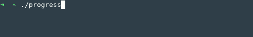

# ProgressCounter
A C++ class representing a text-based progressbar.
For detailed documentation on the class, see the the [doxygen documentation](http://jeinzi.github.io/ProgressCounter/classProgressCounter.html).

  

